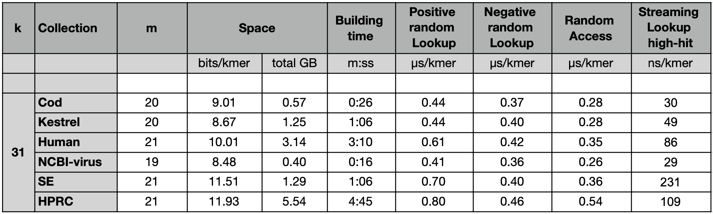
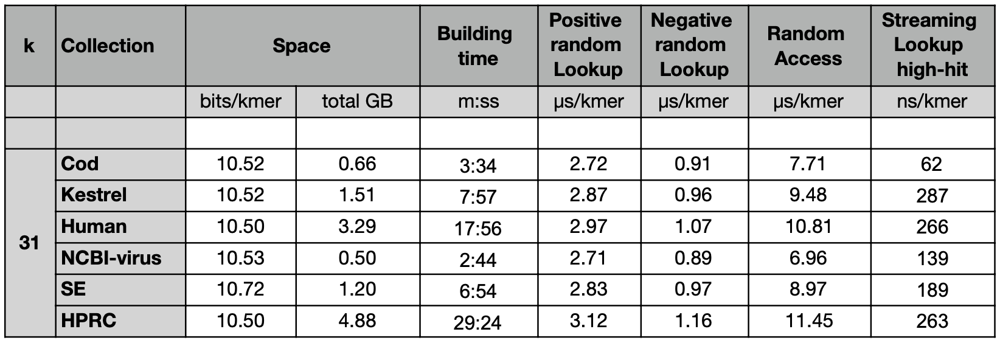
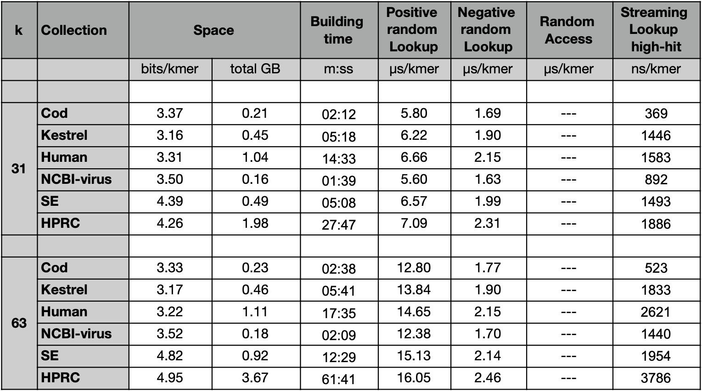

# Kmer sets benchmark

This is a benchmark of data structures for kmer dictionaries,
i.e., data structures that represent a set of kmers and support, at least,
exact membership queries. The goal of the benchmark is to test the
data structures using the same benchmarking code and methodology
(as well as, obviously, the same datasets and queries).

The dictionaries benchmarked here are
[SSHash](https://github.com/jermp/sshash/tree/bench),
[SBWT](https://github.com/algbio/SBWT),
and [FMSI](https://github.com/OndrejSladky/fmsi).
All C++ implementations are by the respective authors.

For these benchmarks we used the datasets available here
[https://zenodo.org/records/17582116](https://zenodo.org/records/17582116): the files `*.eulertigs.fa.gz` were used as input, the `*.fastq.gz` files were used as queries instead.

The scripts to run the benchmark are in the [`script`](script) subfolder.

## Results

These are the results obtained on Nov 2025 (see logs [here](results))
on a machine equipped with an AMD Ryzen Threadripper PRO 7985WX processor clocked at 5.40GHz.
The code was compiled with `gcc` 13.3.0.

The indexes were build with a max RAM usage of 16 GB and 64 threads.
Queries were run using one thread, instead.

**Note**: For SSHash and SBWT, the building time reported in the tables refers to the time it takes to index the `eulertigs.fa.gz` files. FMSI first requires the computation of masked super strings from the `eulertigs.fa.gz` files. We excluded this time from the building time and report only the time FMSI takes to index its computed super strings.

### SSHash

SSHash indexes reported here were built with option `--canonical`.
More results are available here [https://github.com/jermp/sshash/tree/bench/benchmarks](https://github.com/jermp/sshash/tree/bench/benchmarks).

### SBWT

SBWT indexes were all built with option `--add-reverse-complements` so that queries
return the same results as for the other indexes.

### FMSI

